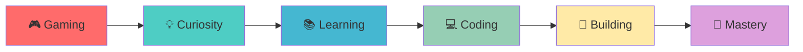

# 👋 **Hi there! I'm Film**

## **(You Can Call Me Fildot)** 🎯

---

### 🚀 _Coding Enthusiast | Gaming Passionate | Tech Explorer_

---

## 🌟 **About Me**

<table>
<tr>
<td width="60%">

> Hello! My name is **Film**, and I'm a **junior developer** passionate about coding and playing computer games. I love exploring new technologies and I'm eager to grow my skills and learn from experienced developers!

**🎯 What Drives Me:**

- 💻 **Learning**: Building my foundation in programming and software development
- 🎮 **Gaming**: Exploring virtual worlds and understanding game mechanics
- 🚀 **Growth**: Constantly improving my skills and taking on new challenges
- 🤝 **Mentorship**: Learning from experienced developers and contributing to teams
- �🚀 **Innovation**: Always seeking new technologies to master
- 🤝 **Collaboration**: Building amazing projects with others

</td>
<td width="40%" align="center">

</td>
</tr>
</table>

---

## 💻 **My Tech Arsenal**

### 🔥 **Programming Languages**

### 🌐 **Web Technologies**

 

<strong>📊 Detailed Skills Breakdown</strong>

 

<table>
<tr>
<td width="50%">

### 🏗️ **Systems & Low-Level**

- **C++** - Systems programming and competitive programming
- **C** - Low-level programming and embedded systems

### 🐍 **Backend & Automation**

- **Python** - Data analysis, automation, and backend development
- **PHP** - Server-side web development

</td>
<td width="50%">

### 🌐 **Frontend & Full-Stack**

- **JavaScript** - Frontend and full-stack web development
- **HTML** - Markup and web structure
- **React** - Frontend JavaScript library
- **Next.js** - Full-stack React framework

### 🗄️ **Database**

- **SQL** - Database management and queries

</td>
</tr>
</table>

---

## 🎯 **My Journey**

```mermaid
graph LR
    A[🎮 Gaming] --> B[💡 Curiosity]
    B --> C[📚 Learning]
    C --> D[💻 Coding]
    D --> E[🚀 Building]
    E --> F[🌟 Mastery]

    style A fill:#ff6b6b
    style B fill:#4ecdc4
    style C fill:#45b7d1
    style D fill:#96ceb4
    style E fill:#ffeaa7
    style F fill:#dda0dd
```

### 🌱 **Always Learning & Growing**

<blockquote>
🚀 As a junior developer, I'm constantly expanding my knowledge and am excited to learn new programming languages and technologies. I'm eager to take on challenges, work with experienced developers, and contribute to meaningful projects!
</blockquote>

**🔍 Currently Learning:**

- 🤖 Advanced JavaScript Concepts
- ⚛️ React Best Practices
- �️ Backend Development with Node.js
- � Computer Science Fundamentals

---

## 🎮 **Beyond Coding**

<table>
<tr>
<td width="50%" align="center">

### 🎯 **Gaming Passion**

When I'm not writing code, you can find me playing computer games - it's another passion that keeps me engaged with technology and problem-solving!

**🎮 Gaming Benefits:**

- 🧠 **Problem Solving**
- ⚡ **Quick Thinking**
- 🤝 **Team Collaboration**
- 🎯 **Strategic Planning**

</td>
<td width="50%" align="center">

### 💡 **Tech Exploration**

I love diving deep into new technologies, understanding how they work, and figuring out how to apply them to solve real-world problems.

**🔍 Areas of Interest:**

- 🌐 **Web Development**
- 📊 **Data Science**
- 🤖 **Artificial Intelligence**
- 🔒 **Blockchain Technology**

</td>
</tr>
</table>

---

## 🤝 **Let's Connect!**

### 📫 **Ready to Learn & Collaborate?**

---

**Feel free to reach out if you'd like to:**

- 🎓 Mentor a junior developer (me!)
- 🚀 Collaborate on beginner-friendly projects
- 💬 Chat about coding and share knowledge
- 🤝 Help me grow as a developer

---

### 🌟 **Growing One Line of Code at a Time!**

---

**🎨 Made with ❤️ by Film (Fildot)**

_"The best way to predict the future is to create it."_

