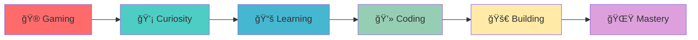

# ✨ **Hi there! I'm Film** ✨

## 🎯 **(You Can Call Me Fildot)** 🎯

 

  

### 🌟 _Junior Developer | Gaming Passionate | Lifelong Learner_ 🌟

 

 

## 🌟 **About Me**

 

<table align="center">
<tr>
<td width="50%" align="center">

### 💫 **My Story**

> Hello! My name is **Film**, and I'm a **junior developer** passionate about coding and playing computer games. I love exploring new technologies and I'm eager to grow my skills and learn from experienced developers!

</td>
<td width="50%" align="center">

### 📊 **GitHub Stats**

</td>
</tr>
</table>

 

### 🎯 **What Drives Me**

<table>
<tr>
<td align="center" width="25%">
 
<strong>💻 Learning</strong> 
<em>Building my foundation in programming and development</em>
</td>
<td align="center" width="25%">
 
<strong>🮠Gaming</strong> 
<em>Exploring virtual worlds and understanding game mechanics</em>
</td>
<td align="center" width="25%">
 
<strong>🚀 Growth</strong> 
<em>Constantly improving skills and taking on new challenges</em>
</td>
<td align="center" width="25%">
 
<strong>🤠Mentorship</strong> 
<em>Learning from experienced developers and contributing</em>
</td>
</tr>
</table>

 

</td>
</tr>
</table>

---

## 💻 **My Tech Arsenal**

 

### 🔥 **Programming Languages**

<table>
<tr>
<td align="center" width="16.66%">
 

</td>
<td align="center" width="16.66%">
 

</td>
<td align="center" width="16.66%">
 

</td>
<td align="center" width="16.66%">
 

</td>
<td align="center" width="16.66%">
 

</td>
<td align="center" width="16.66%">
 

</td>
</tr>
</table>

 

### 🌐 **Web Technologies**

<table>
<tr>
<td align="center" width="33.33%">
 

</td>
<td align="center" width="33.33%">
 

</td>
<td align="center" width="33.33%">
 

</td>
</tr>
</table>

 

 

<strong>📊 Detailed Skills Breakdown</strong>

 

<table>
<tr>
<td width="50%">

### 🏗️ **Systems & Low-Level**

- **C++** - Systems programming and competitive programming
- **C** - Low-level programming and embedded systems

### 🐍 **Backend & Automation**

- **Python** - Data analysis, automation, and backend development
- **PHP** - Server-side web development

</td>
<td width="50%">

### 🌐 **Frontend & Full-Stack**

- **JavaScript** - Frontend and full-stack web development
- **HTML** - Markup and web structure
- **React** - Frontend JavaScript library
- **Next.js** - Full-stack React framework

### 🗄️ **Database**

- **SQL** - Database management and queries

</td>
</tr>
</table>

---

## 🎯 **My Journey**

### 🌱 **Always Learning & Growing**

<blockquote>
🚀 As a junior developer, I'm constantly expanding my knowledge and am excited to learn new programming languages and technologies. I'm eager to take on challenges, work with experienced developers, and contribute to meaningful projects!
</blockquote>

**🔍 Currently Learning:**

- 🤖 Advanced JavaScript Concepts
- ⚛️ React Best Practices
- �️ Backend Development with Node.js
- � Computer Science Fundamentals

---

## 🎮 **Beyond Coding**

<table>
<tr>
<td width="50%" align="center">

### 🎯 **Gaming Passion**

When I'm not writing code, you can find me playing computer games - it's another passion that keeps me engaged with technology and problem-solving!

**🎮 Gaming Benefits:**

- 🧠 **Problem Solving**
- ⚡ **Quick Thinking**
- 🤝 **Team Collaboration**
- 🎯 **Strategic Planning**

</td>
<td width="50%" align="center">

### 💡 **Tech Exploration**

I love diving deep into new technologies, understanding how they work, and figuring out how to apply them to solve real-world problems.

**🔍 Areas of Interest:**

- 🌐 **Web Development**
- 📊 **Data Science**
- 🤖 **Artificial Intelligence**
- 🔒 **Blockchain Technology**

</td>
</tr>
</table>

---

## 🤝 **Let's Connect!**

## 🤝 **Let's Connect!**

### 📫 **Ready to Learn & Collaborate?**

 

<table align="center">
<tr>
<td align="center" width="33.33%">
 

</td>
<td align="center" width="33.33%">
 

</td>
<td align="center" width="33.33%">
 

</td>
</tr>
</table>

 

### 💌 **Feel free to reach out if you'd like to:**

<table align="center">
<tr>
<td align="center" width="25%">
📠<strong>Mentor a junior developer (me!)</strong>
</td>
<td align="center" width="25%">
🚀 <strong>Collaborate on beginner projects</strong>
</td>
<td align="center" width="25%">
💬 <strong>Chat about coding & share knowledge</strong>
</td>
<td align="center" width="25%">
🤠<strong>Help me grow as a developer</strong>
</td>
</tr>
</table>

 

### 🌟 **Growing One Line of Code at a Time!**

  

---

### 🎨 **Made with ❤️ by Film (Fildot)**

 

  

_"The best time to plant a tree was 20 years ago. The second best time is now."_

 

**🌟 Let's grow together in this amazing world of code! 🌟**

_"The best way to predict the future is to create it."_

